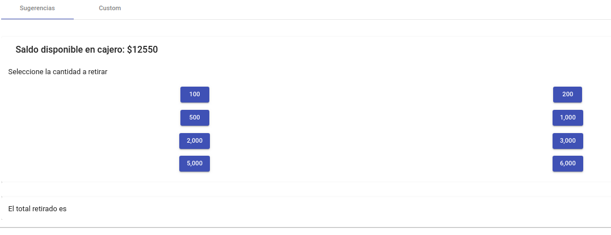
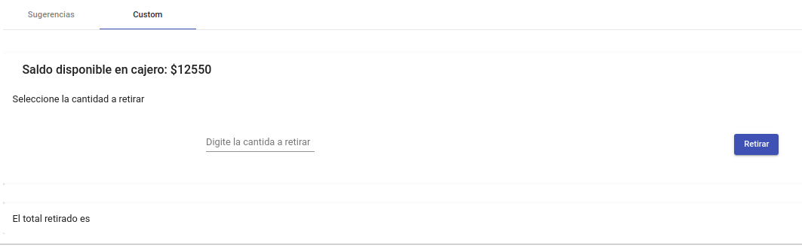
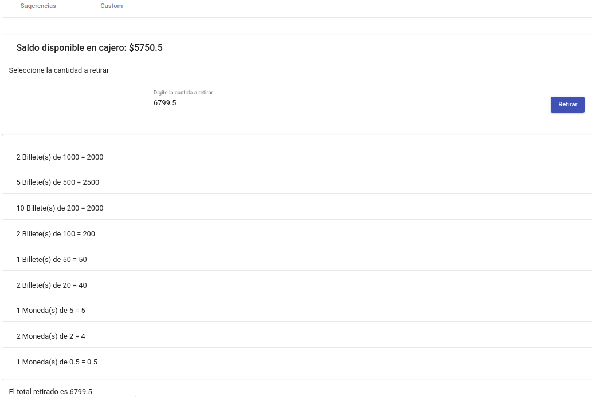
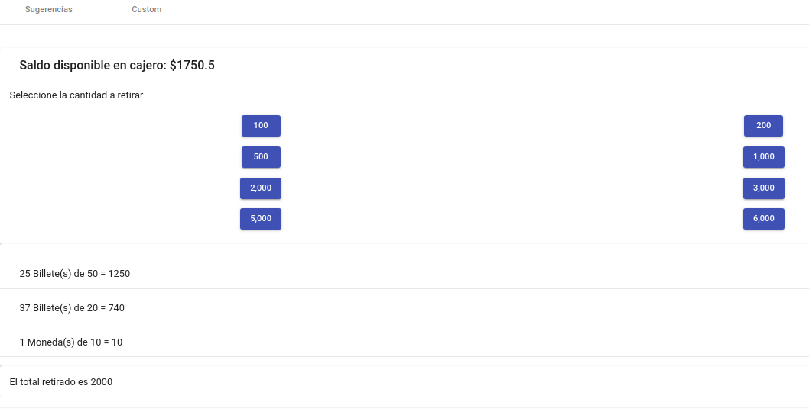

# Cajero-examen
Es una aplicacion separada en backend(Spring boot, Kotlin, MySQL) y frontend (Angular 7) que simula el funcionamiento de un cajero automatico, en donde solicitas una cantidad de efectivo y te desglosa la entrega de billetes y monedas

## Instalacion 
Ejecutar data-mysql.sql para cargar tablas y datos en una base de datos MySQL.

Ejecutar cajero: aplicacion construida en Spring boot + Kotlin.

Ejecutar cajero-front como aplicacion de Angular.

## Develop by Sazke
